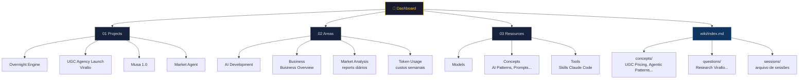
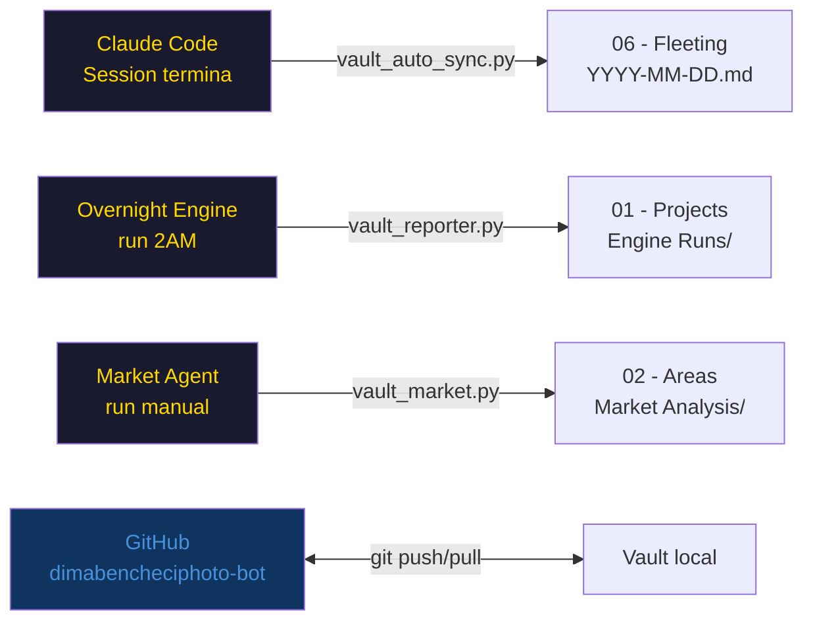

# Arquitectura do Second Brain

---

## Estrutura de pastas

```
Second Brain/
│
├── 00 - Home/                  ← ENTRADA PRINCIPAL
│   ├── Dashboard.md            ← hub central (Dataview queries)
│   ├── Sobre Mim.md
│   ├── Como Usar Este Vault.md
│   └── Arquitectura do Vault.md  ← este ficheiro
│
├── 01 - Projects/              ← O QUE ESTÁS A CONSTRUIR (tem deadline)
│   ├── _MOC Projects.md        ← índice de projectos
│   ├── Overnight Engine.md
│   ├── UGC Agency Launch.md
│   ├── Musa 1.0.md
│   ├── Market Agent.md
│   ├── Engine Runs/            ← logs automáticos das runs
│   ├── UGC Agency/             ← reports de pipeline
│   └── UGC Outreach Runs/
│
├── 02 - Areas/                 ← RESPONSABILIDADES CONTÍNUAS (sem deadline)
│   ├── _MOC Areas.md           ← índice de áreas
│   ├── AI Development/
│   ├── Business/               ← Business Overview, UGC Agency, KPIs
│   ├── Learning/               ← Learning Log
│   ├── Market Analysis/        ← reports diários de mercado
│   └── Token Usage/            ← custos semanais API
│
├── 03 - Resources/             ← CONHECIMENTO DE REFERÊNCIA (atemporal)
│   ├── _MOC Resources.md       ← índice de recursos
│   ├── Models/                 ← Claude Models, Model Comparison
│   ├── Concepts/               ← AI Patterns, Prompt Engineering, etc.
│   ├── Prompts/                ← Prompt Library
│   └── Tools/                  ← Claude Code Skills
│
├── 04 - Archive/               ← PROJECTOS TERMINADOS
│   └── Second Brain Cleanup.md
│
├── 05 - Templates/             ← TEMPLATES REUTILIZÁVEIS
│   ├── Project Template.md
│   ├── Daily Note.md
│   └── ...
│
├── 06 - Fleeting/              ← NOTAS DIÁRIAS (auto-geradas)
│   └── YYYY-MM-DD.md           ← 1 linha por sessão Claude
│
└── wiki/                       ← CONHECIMENTO PROCESSADO
    ├── index.md                ← catálogo do wiki
    ├── log.md                  ← log de operações (append-only)
    ├── hot.md                  ← contexto recente (~500 palavras)
    ├── overview.md             ← resumo executivo dos 4 sistemas
    ├── concepts/               ← UGC Pricing, AI Patterns, etc.
    ├── questions/              ← sínteses de research (autoresearch)
    ├── sources/                ← referências externas
    ├── sessions/               ← notas de sessão arquivadas
    └── meta/                   ← lint reports
```

---

## Diagrama de fluxo



---

## Regra de ouro — onde vai cada coisa?

| Tipo de conteúdo | Onde guardar |
|-----------------|--------------|
| Projecto com objetivo e deadline | `01 - Projects/` |
| Responsabilidade contínua | `02 - Areas/` |
| Referência atemporal (SDK, patterns) | `03 - Resources/` |
| Projecto terminado | `04 - Archive/` |
| Conceito processado, framework | `wiki/concepts/` |
| Síntese de research | `wiki/questions/` |
| Referência externa | `wiki/sources/` |
| Nota de sessão Claude | `wiki/sessions/` |

---

## Automações activas



---

## Como navegar

1. **Entrada** → [[Dashboard]] (sempre)
2. **Projectos activos** → [[_MOC Projects]]
3. **Estado de um sistema** → `02 - Areas/` → área relevante
4. **Referência técnica** → [[_MOC Resources]] → nota específica
5. **Conhecimento processado** → `wiki/index.md` → concept/question
6. **Contexto recente** → `wiki/hot.md` (500 palavras, actualizado após cada sessão)

---

*Actualizado: 2026-06-08 · [[Dashboard]] · [[wiki/index.md|Wiki Index]]*
